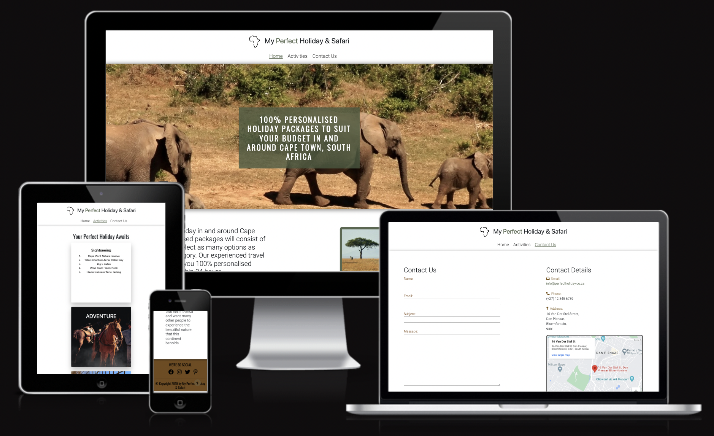
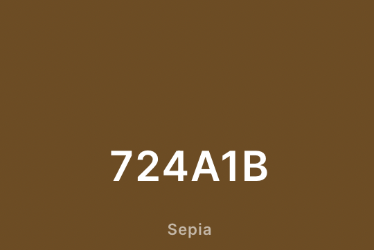
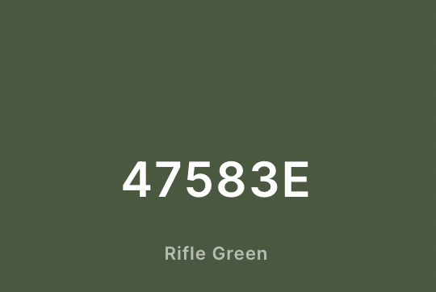
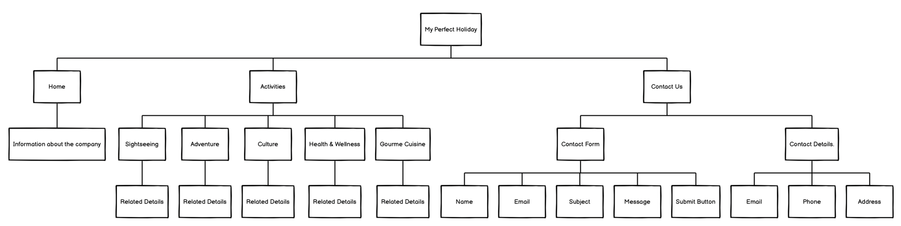
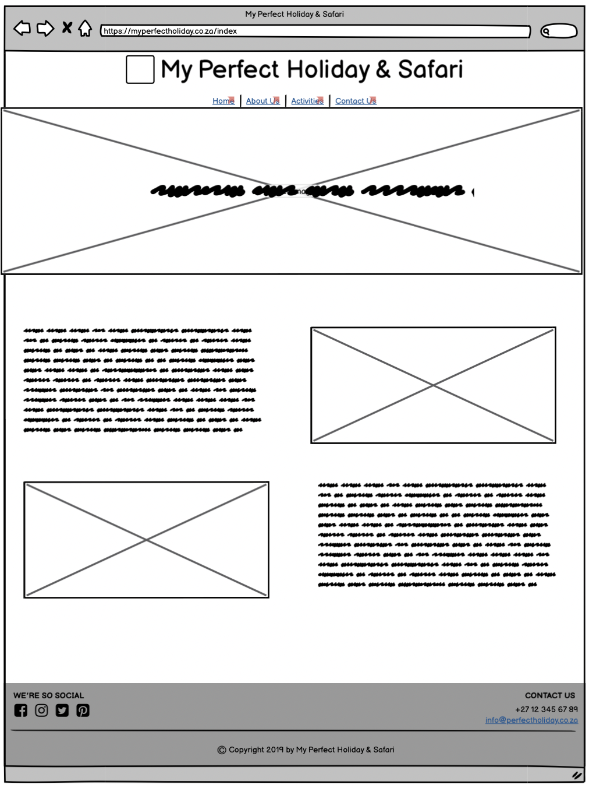
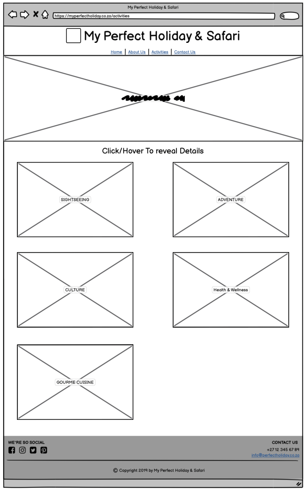

# My Perfect Holiday & Safari

My Perfect Holiday & Safari is a company that prides itself in creating the best holiday experience one can imagine in and around Cape Town, South Africa. The agents you will be working with is professional and has traveled far and wide, and knows exactely what will suit your budget and travel needs.

My Perfect Holiday and Safari is a website idea for a Travel Agency (My Perfect Holiday & Safari). 
The purpose of this website is to advertise the company, My Perfect Holiday & Safari and to showcase the possible adventures and offers that the client
can experience by using the services of this Travel Agency.

The website design is inspired by the safari and all it's beauty.

The Webiste can be viewed live by [clicking on this link!](https://quack842.github.io/my-perfect-holiday/)

# Table Of Contents

1. [User Experience (UX)](#user-experience-ux)
    * [Project Goals](#project-goals)
    * [User Goals](#user-goals)
    * [Color Scheme](#color-scheme)
    * [Typography](#typography)
    * [Wireframes](#wireframes)
2. [Features](#features)

# User Experience (UX)
[Back To Top](#my-perfect-holiday--safari)  
[Back To Table Of Contents](#table-of-contents)

My Perfect Holiday & Safari website is designed with the intent for the user to navigate and use the website with
ease. 
The Website is easily navigatable and has large text that will make it simple read.

## Project Goals

The main Goal of My Perfect Holiday & Safari is to advertise the Travel Agency's services and the different available Activities, the Website has a African/Safari feel to it. This shows the customer that Agency is based in South Africa and can offer the best deals and experiences.

## User Goals

* The user will be able to naviagte easily throughout the site and inderstand all the contents that is provided.
* The user will find enough information about the Travel Agency and will also be able to contact them through a Contact Us Form that they can fill in 
or the customer can contact the Travel Agency through the provided Contact Details.
* The user will also be able to view the different Activities that are available for them to include in their perfect holiday bundle.
* The user will also be able to access the website from any device with access to a browser i.e Smartphone, Tablet and/or a Computer and the website will be responsive to said device.

## Color Scheme

The Main Color Scheme that was chosen for this website was based on the typical color that would come to mind if one was to think of Africa or Safari. When designing the website, the main color #724A1B and #47583E came to mind. I used the website [Coolor](https://coolors.co/) to generate the complementary colors that will fit hand-in-hand with the main colors that was chosen.
 

## Typography

The Main font that is used for this website is Roboto and the secondary font is Oswald. The font, sans-serif, is used as a back-up font for incase the user's browser does not supoort the main and secondary fonts. The website [Google Fonts](https://fonts.google.com/) was used to select and import the fonts.

The website [Font Awesome](https://fontawesome.com/) was used for the icons that can be seen in the footer and on the Conact Us page.

## Wireframes

The Application [Balsamiq](https://balsamiq.com/) was used to create the basic idea and layout for the My Perfect Holiday & Safari website as suggested by code institute.

    
Simple Site Map

    
  
This Sitemap was design to get the basic layout and structure of the website.

    
Home Page

    
  
The Home Page is a simple page with information about the Travel Agency and what they can offer. In The original design, The About Page was included as a extra html page. It was suggested by my Mentor that it might be a better and cleaner idea to combine the Home and About Us page, I agreed to that suggestion and added the About Us Information below the Home Page Information.

    
Activities Page

    
  
On the Activities Page, there are 5 cards that is presented and will flip around and reveal the related information when the card is clicked/hovered over.

In the original design, the Hero image was displayed at the top of the Activities and Contact Us pages. My Mentor asked if the hero image was needed on the other pages as well and challenged me to find a way to show the relation to the pages without a hero image on every single page. I came to the conclution that having a shadow below the navigation bar will show the relation between the pages without the need of the hero image on each page.

    
Contact Us Page

    
  
On the Contact Us Page, there are to panels, a left and a right panel. The left panel displays the Contact Form and the Right Panel Displays the Contact Information.

  

# Features
[Back To Top](#my-perfect-holiday--safari)  
[Back To Table Of Contents](#table-of-contents)

